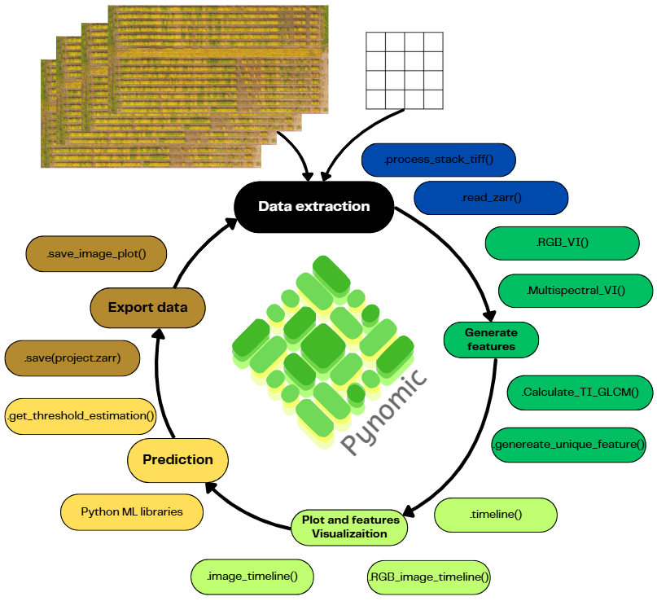

---
title: 'Pynomic: Data extraction library for orthomosaic images in plant breeding trials'
tags: 
  - Python
  - Phenomics
  - High Throughput Phenotyping
  - senescence
  - Unmanned Aerial Vehicles
authors:
  - name: Juan Manuel Fiore
    orcid: 0009-0009-3421-1299
    corresponding: true
    affiliation: 1
  - name: Cecilia Bruno
    orcid: 0000-0002-3674-7128
    affiliation: "1, 2"
affiliations:
  - name: Universidad Nacional de Córdoba (UNC)
    index: 1
  - name: Cátedra de Estadistica y Biometría.
    index: 2

bibliography: paper.bib
---
# Summary 

[`Pynomic`](https://pynomic.readthedocs.io/en/latest/) is an open-source Python package build on Zarr allowing the processing of large datasets. Automates data workflows for plant breeding trials, handles the data extraction from times series orthomsaics, Vegetation Index calculation, Textural features, image extraction, times series visualization, storage and prediction of critical plot states such as senescence and canopy closure. It includes broad documentation and examples with reference to open-source datasets. Making it especially accessible to new researchers in this area while allowing more experienced researchers to contribute on the development of new models and tools for the plant breeding community.

# Statement of need

Plant breeding is the discipline of developing cultivars tailored to specific objectives, aiming to optimize plant-derived resources for society. These objectives include increasing yield and protein content, enhancing resilience to biotic or abiotic stress, and improving fiber or oil production. For that, first, genetic variability is created by crossing different individuals. Then their progeny is tested in the field. This part of the process is the most expensive since normally experimental varieties are tested in multi-environmental trials with multiple repetitions. This generates the data to select the best individuals.

One of the crucial steps in plant breeding is the collection of data from field trials to characterize and understand the behavior of each experimental plant variety and choose the best ones that adapt to the desired environments, making the task labor-intensive, high costs and prone to human bias. To avoid this situation, the use of drones or unmanned aerial vehicles has expanded due to their capabilities to phenotype thousands of plots in a matter of minutes, relatively low costs, and objective measurements [@HTP_to_accelerate_crop_breeding]. This new approach opens a field of possibilities to obtain accurate and objective data used to train models for yield predictions [@grain_crop_yield_pred_review], length of cycle [@Volpato_maturity], lodging [@autoML_pipeline_HTP], monitoring plant stress, and many other cases [@Big_Data_Agriculture].

The raw data generated by UAVs has to be processed to produce meaningful information. Many methods have been developed, but they require manual action or are not adequate for large datasets which can make the process slow and tedious. The volume of data handled makes the process resource-demanding. Pynomic aims to stream line this process in order to standardize and simplify the accessibility of the data for the researchers. Reducing the gap between raw data and data ready to use.

# Similar Projects

Most of the works done on drone phenotyping are done with graphical user interface (GUI) based on
geographic information system (GIS) such as QGIS[@QGIS_software] or ArcGIS[@Arcgis_software]. Conventional GIS software requires manual input and interaction
which is non-reproducible and slow for high-thought put phenotyping.

Within the programming ecosystem, FIELDimageR[@fieldimager] written in R usually used for analyzing single date images and few hundreds of plots.
EasyIDP[@wang_easyidp_2021] is developed in Python and it's main focus is to do a backwards reprojection of the 
orthomosaics to extract the area of interest from the original images.

`Pynomic` inserts in this field as being able to process big datasets in a times series format. It provides functionalities
such as automatic clipping and orientation of the plot, exporting the images with it's respective date and identification number, plotting functions to visualize variety evolution through time and comparison with vegetation index. plant senescence estimation models, automatic calculation of features and an interactive way to input custom-user functions.
`Pynomic` was designed to support two primary modeling paradigms. The first is feature generation, where spatial and spectral attributes—such as Vegetation Indices (VIs), textural information, and band statistics are extracted from plot-level imagery across time-series data. Beyond its built-in library, `Pynomic` empowers researchers to implement custom functions for bespoke feature extraction. The second approach leverages Deep Learning architectures, utilizing raw image matrices as inputs for CNN-LSTM models to predict complex traits like yield, senescence, and biotic stress. To facilitate this, `Pynomic` automates the organization and retrieval of imagery indexed by unique plot IDs, image orientation and timestamps.
Furthermore, `Pynomic` optimizes data management by saving projects in the Zarr format [@zarr_python], significantly reducing disk space and accelerating project initialization. This is made possible by its core architecture, centered around the Pynomic_Project object. This object encapsulates all plot matrices, organized by date and spectral band, and includes built-in functions that allow users to easily iterate through and access individual plots.

**key features of `Pynomic`**

1.  Automated Time-Series Phenotyping: Pynomic automates the extraction
    of plot-level data from time-series UAV orthomosaics (both RGB and
    Multispectral), streamlining high-throughput phenotyping workflows.

2.  Optimized Computational Efficiency: Reduces RAM usage
    and disk space requirements for large datasets through its
    Zarr-based backend and lazy loading capabilities.

3.  Flexible Feature Engineering: Offers built-in calculation of common
    Vegetation Indices (VIs) and Textural Features (TFs), alongside a
    framework for users to easily define and apply custom feature
    extraction functions.

4.  Integrated Analytical Tools: Includes functionalities for practical
    applications, such as senescence and maturity prediction models, and
    facilitates seamless integration with the broader Python machine
    learning ecosystem.

5.  Open-Source and Quality-Focused: Provides a user-friendly,
    [documented](https://pynomic.readthedocs.io/en/latest/), tested open-source library,
    developed to high standards to foster reproducibility and
    accessibility in plant phenotyping research.

# Pynomic Scheme

# AI usage disclosure
AI tools were employed to translate and improve the readability of this manuscript, all content has been thoroughly reviewed by the authors.

# References