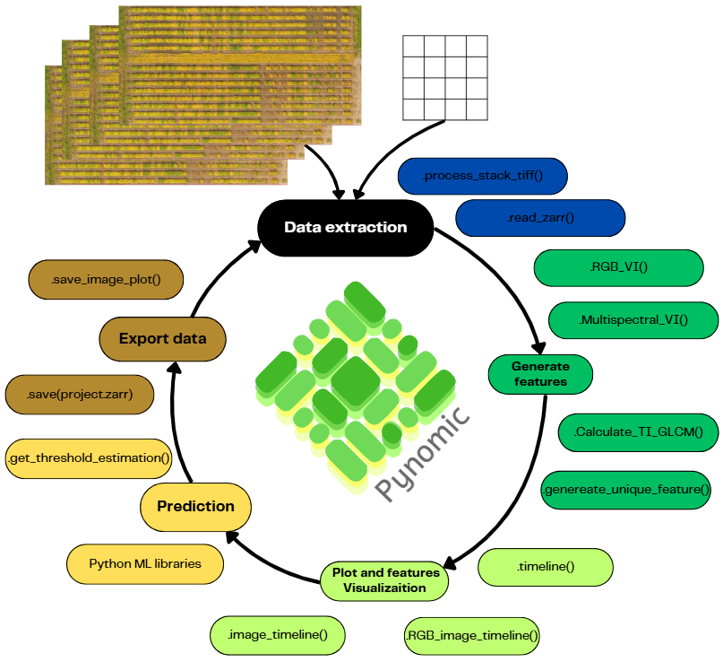

---
title: 'Pynomic: Data extraction library for orthomosaic images in plant breeding trials'
tags: 
  -Pyhton
  -Phenomics
  -High Throughtput phenotyping
  -sencence
  -Unmanned Aerial Vehicles
authors:
  -name: Juan Manuel Fiore
   orcid: 0009-0009-3421-1299
   correspondig: true
   affiliation: 1
  -name: Cecilia Bruno
   orcid: 0000-0002-3674-7128
   affiliation: "1, 2"
affiliations:
  -name: Universidad Nacional de Córdoba (UNC)
   index: 1
  -name: Cátedra de Estadistica y Biometría.
   index: 2

bibliography: paper.bib
---
# Summary 

Plant breeding is the discipline that develops cultivars that meet certain conditions with the purpose to optimize the resource gathering from plants to society. These conditions can be yield, high protein, resilience to biotic or abiotic stress, fiber, oil, etc. For that, first, genetic variability is created by crossing different individuals. Then their progeny is tested in the field. This part of the process is the most expensive since normally they are tested in multi-environmental trials with multiple repetitions. This generates data to select the best individuals.

One of the crucial steps in plant breeding is the collection of data from field trials to characterize and understand the behavior of each experimental plant variety and choose the best ones that adapt to the desired environments. This task is labor-intensive and thus has high costs. To avoid this situation, the use of drones or unmanned aerial vehicles has expanded due to their capabilities to phenotype thousands of plots in a matter of minutes, relatively low costs, and objective measurements [@HTP_to_accelerate_crop_breeding]. This opens a field of possibilities to obtain accurate and objective data used to train models for yield predictions [@grain_crop_yield_pred_review], length of cycle [@Volpato_maturity], lodging [@autoML_pipeline_HTP], monitoring plant stress, and many other cases [@Big_Data_Agriculture]. Pynomic automates the data extraction of images from plant breeding fields taken by Unmanned Aerial Vehicles (UAVs).

# Statment of need
The raw data generated by UAVs has to be processed to extract meaningful information. Many methods have been developed, but they require manual action, which can make the process slow and tedious. As well, the volume of data handled makes the process resource-demanding.

Pynomic is a Python-based, open-source library that automates data workflows for plant breeding trials. It handles the extraction, analysis, and visualization of data from time-series orthomosaics, enabling researchers to monitor the growth, senescence, and stress patterns of each plot while addressing common challenges in data management. To achieve this efficiency, Pynomic relies heavily on the zarr library[@zarr_python], which provides fast and easy background access to the image matrices.

Pynomic was designed as a versatile data extraction tool. It can generate numerical features, such as Vegetation Indices (VIs) and textural information, using both pre-built and custom user-defined functions. Additionally, it prepares data for image-based models by automating the cropping, orientation, and saving of individual plots as .tiff and .png files.

**key features of `Pynomic`**

1.  Automated Time-Series Phenotyping: Pynomic automates the extraction
    of plot-level data from time-series UAV orthomosaics (both RGB and
    Multispectral), streamlining high-throughput phenotyping workflows.

2.  Optimized Computational Efficiency: Significantly reduces RAM usage
    and disk space requirements for large datasets through its
    Zarr-based backend and lazy loading capabilities, leading to faster
    processing times.

3.  Flexible Feature Engineering: Offers built-in calculation of common
    Vegetation Indices (VIs) and Textural Features (TFs), alongside a
    framework for users to easily define and apply custom feature
    extraction functions.

4.  Integrated Analytical Tools: Includes functionalities for practical
    applications, such as senescence and maturity prediction models, and
    facilitates seamless integration with the broader Python machine
    learning ecosystem.

5.  Open-Source and Quality-Focused: Provides a user-friendly,
    well-documented, and rigorously tested open-source library,
    developed to high standards to foster reproducibility and
    accessibility in plant phenotyping research.

[Documentation and examples](https://pynomic.readthedocs.io/en/latest/) of use has been created.

# Pynomic Scheme

Fig 1: Display of Pynomic workloflow and functionalities.

# References